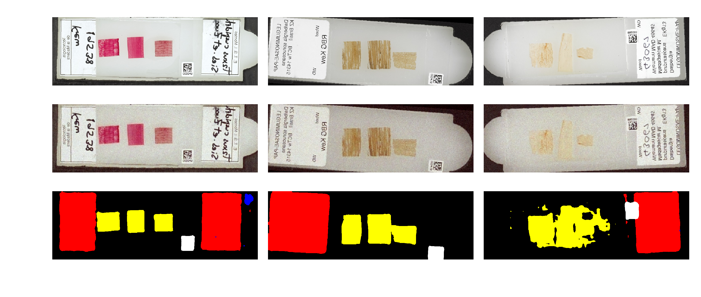
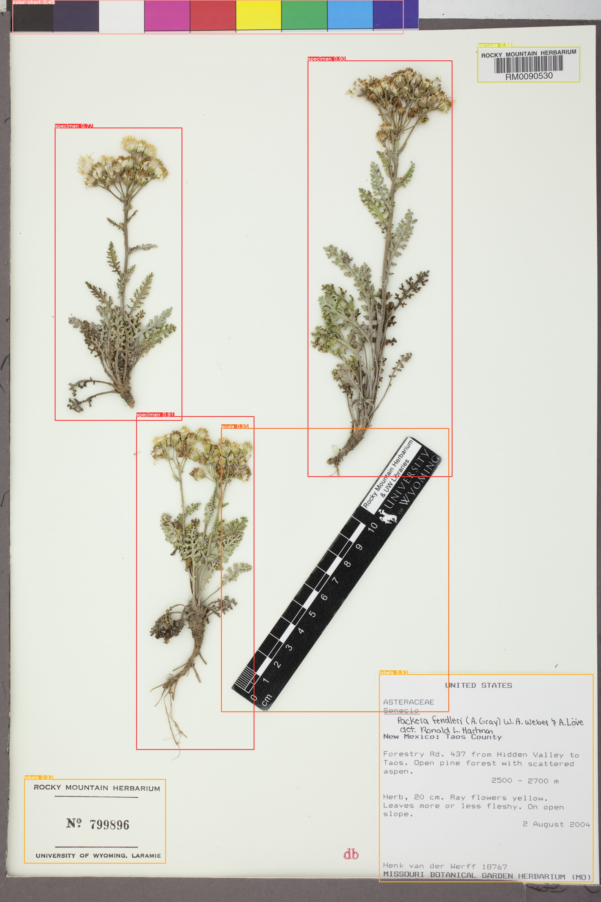

**[简体中文](./README.CN.md) | English**

[](https://github.com/lyzsk/analysis-of-herbarium-sheets/blob/master/LICENSE) [](https://github.com/lyzsk/analysis-of-herbarium-sheets/members) [](https://github.com/lyzsk/analysis-of-herbarium-sheets/stargazers)   

---

# About The Project

This project is to train semantic segmentation with supervised learning (Deeplabv3+, U-Net, PSPNet) and semi-supervised learning (NaturalHistoryMeuseum(NHM) semantic segmentation) for herbarium sheets and microscopy slides. And perform one-stage supervised object detection(YOLOv5) to find the mistakes on classification.

> **_If you like this project or it helps you in some way, don't forget to star._** :star:

Training datasets are provided by: NMWHS, MNHNS, MIXSETHS.

-   The training datasets can be access here: [Download Link](https://zenodo.org/record/4448186)
-   In order to get more ideal result, I trained combination of original training datasets(2000 images) with small part of Wyoming's datasets(200 images) by using [labelme](https://anaconda.org/conda-forge/labelme).

Prediction datasets are provided by Wyoming University.

-   The datasets used for predict can be accessed here:
    -   [Balsamorhiza_incana](https://rmh.uwyo.edu/images/cardiff/Balsamorhiza_incana.zip)
    -   [Balsamorhiza_sagittata](https://rmh.uwyo.edu/images/cardiff/Balsamorhiza_sagittata.zip)
    -   [Geum_aleppicum](https://rmh.uwyo.edu/images/cardiff/Geum_aleppicum.zip)
    -   [Geum_macrophyllum_var_perincisum](https://rmh.uwyo.edu/images/cardiff/Geum_macrophyllum_var_perincisum.zip)
    -   [Mertensia_lanceolata](https://rmh.uwyo.edu/images/cardiff/Mertensia_lanceolata.zip)
    -   [Mertensia_viridis](https://rmh.uwyo.edu/images/cardiff/Mertensia_viridis.zip)
    -   [Oxytropis_besseyi_var_besseyi](https://rmh.uwyo.edu/images/cardiff/Oxytropis_besseyi_var_besseyi.zip)
    -   [Oxytropis_lambertii_var_lambertii](https://rmh.uwyo.edu/images/cardiff/Oxytropis_lambertii_var_lambertii.zip)
    -   [Packera_fendleri](https://rmh.uwyo.edu/images/cardiff/Packera_fendleri.zip)
    -   [Packera_multilobata](https://rmh.uwyo.edu/images/cardiff/Packera_multilobata.zip)

# Table of content:

1. [NHM-semantic-segmentation](#nhm-semantic-segmentation)
2. [Deeplabv3-Plus-pytorch](#deeplabv3-plus-pytorch)
    - [installation](#installation)
    - [get start](#get-start)
    - [example result](#example-result)
3. [U-Net-Pytorch](#u-net-pytorch)
    - [installation](#installation-1)
    - [get start](#get-start-1)
    - [example result](#example-result-1)
4. [PSPNet-Pytorch](#pspnet-pytorch)
    - [installation](#installation-2)
    - [get start](#get-start-2)
    - [example result](#example-result-2)
5. [YOLOv5-pytorch](#yolov5-pytorch)
    - [installation](#installation-3)
    - [get start](#get-start-3)
    - [example result](#example-result-3)

# NHM-semantic-segmentation

Details @see https://github.com/NaturalHistoryMuseum/semantic-segmentation

Because the origin code is even not runnable :cold_sweat:, what I did:

1. add `torch.backends.cudnn.benchmark = True` to first line of code :neutral_face:
2. rewrite the `trainmodel.py` and `predict.py`, at least it can train microscope slides now, and can do segmentation on the trained model. But still cannot train herbarium sheets, and I don't want to go further because I have more readable code choice to reinvent :neutral_face:

## Example result



# Deeplabv3-Plus-pytorch

## Installation

```
<!-- Manual installation -->
conda create -n deeplabv3plus python=3.9

conda install pytorch torchvision torchaudio cudatoolkit=11.6 -c pytorch -c conda-forge

pip install scipy==1.9.1

pip install matplotlib==3.5.3

pip install opencv-python==4.6.0.66

pip install tqdm==4.64.1

pip install h5py==3.7.0

pip install tensorboard==2.10.0

<!-- Auto installation -->
conda create -n deeplabv3plus python=3.9

pip install -r requirements.txt
```

> :warning: IMPORTANT: if you want to use GPU mode, check you download related CUDA and CUDNN.

## Get start

```python
# train
python train.py

# predict
python predict.py

# get mIOU.png, mPA.png, mPrecision.png, mRecall.png, confusion_matrix.csv, detection-results
python get_miou.py

# labelme JSON to deeplab PNG
python labelme_to_deeplab.py

# convert 24-bit depth PNG to 8-bit depth PNG
python convert_labelled.py

# generate train-test-val TXT
python get_annotation.py
```

> :rainbow: More details see [README](./deeplabv3-plus-pytorch/README.md) or [README.CN](./deeplabv3-plus-pytorch/README.CN.md)

## Example result


# U-Net-Pytorch

## Installation

```
<!-- Manual installation -->
conda create -n unet python=3.9

conda install pytorch torchvision torchaudio cudatoolkit=11.6 -c pytorch -c conda-forge

pip install scipy==1.9.1

pip install matplotlib==3.5.3

pip install opencv-python==4.6.0.66

pip install tqdm==4.64.1

pip install h5py==3.7.0

pip install tensorboard==2.10.0

pip install onnx==1.12.0

<!-- Auto installation -->
conda create -n unet python=3.9

pip install -r requirements.txt
```

## Get start

```python
# train
python train.py

# predict
python predict.py

# get mIOU.png, mPA.png, mPrecision.png, mRecall.png, confusion_matrix.csv, detection-results
python get_miou.py

# labelme JSON to unet PNG
python labelme_to_unet.py

# convert 24-bit depth PNG to 8-bit depth PNG
python convert_labelled.py

# generate train-test-val TXT
python get_annotation.py
```

> :rainbow: More details see [README](./unet-pytorch/README.md) or [README.CN](./unet-pytorch/README.CN.md)

## Example result


# PSPNet-Pytorch

## Installation

```
<!-- Manual installation -->
conda create -n pspnet python=3.9

conda install pytorch torchvision torchaudio cudatoolkit=11.6 -c pytorch -c conda-forge

pip install scipy==1.9.1

pip install matplotlib==3.5.3

pip install opencv-python==4.6.0.66

pip install tqdm==4.64.1

pip install h5py==3.7.0

pip install tensorboard==2.10.0

pip install onnx==1.12.0

<!-- Auto installation -->
conda create -n pspnet python=3.9

pip install -r requirements.txt
```

## Get start

```python
# train
python train.py

# predict
python predict.py

# get mIOU.png, mPA.png, mPrecision.png, mRecall.png, confusion_matrix.csv, detection-results
python get_miou.py

# labelme JSON to pspnet PNG
python labelme_to_pspnet.py

# convert 24-bit depth PNG to 8-bit depth PNG
python convert_labelled.py

# generate train-test-val TXT
python get_annotation.py
```

> :rainbow: More details see [README](./pspnet-pytorch/README.md) or [README.CN](./pspnet-pytorch/README.CN.md)

## Example result


# YOLOv5-pytorch

> :warning: IMPORTANT: This project is still in TODO mode<br>
> :warning: IMPORTANT: This project is still in TODO mode<br>
> :warning: IMPORTANT: This project is still in TODO mode<br>
> 重要的事情说三遍 Important things said three times

## Installation

```
<!-- Manual installation -->
conda create -n yolov5 python=3.9

conda install pytorch torchvision torchaudio cudatoolkit=11.6 -c pytorch -c conda-forge

pip install scipy==1.9.1

pip install matplotlib==3.5.3

pip install opencv-python==4.6.0.66

pip install tqdm==4.64.1

pip install h5py==3.7.0

pip install tensorboard==2.10.0

pip install onnx==1.12.0

<!-- Auto installation -->
conda create -n yolov5 python=3.9

pip install -r requirements.txt
```

## Get start

```python
# train
python train.py

# predict
python predict.py

# get detection-results, ground-truth, images-optional, results
python get_map.py

# generate train-test-val TXT
python voc_annotation.py
```

> :rainbow: More details see [README](./yolov5-pytorch/README.md) or [README.CN](./yolov5-pytorch/README.CN.md)

## Example result




# Reference

https://github.com/NaturalHistoryMuseum/semantic-segmentation

https://github.com/ultralytics/yolov5

https://github.com/tensorflow/models

https://github.com/ggyyzm/pytorch_segmentation

https://github.com/bonlime/keras-deeplab-v3-plus

https://github.com/matterport/Mask_RCNN

https://github.com/leekunhee/Mask_RCNN

https://github.com/anylots/detection

https://github.com/yyccR/yolov5_in_tf2_keras

https://github.com/wkentaro/labelme/

https://github.com/xiaotudui/PyTorch-Tutorial

https://github.com/bubbliiiing/deeplabv3-plus-pytorch

https://github.com/bubbliiiing/pspnet-pytorch

https://github.com/bubbliiiing/unet-pytorch

> 跪了，感谢大佬们上传代码给我抄，要不然真的交不了作业了 :tired_face::tired_face::tired_face:

# LICENSE

[LICENSE](./LICENSE)

---

> TODO: built with Flask output API into React + Springboot + SpringMVC + MybatisPlus + Redis + RabbitMQ + MongoDB + MySQL + Elasticsearch + Druid + FastDFS + Kubernetes + Docker+++++++++++++++++++++++ 淦 救救孩子吧
